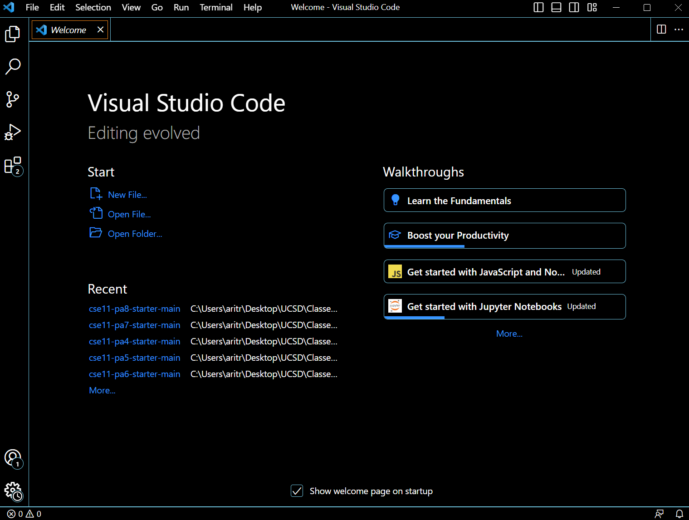
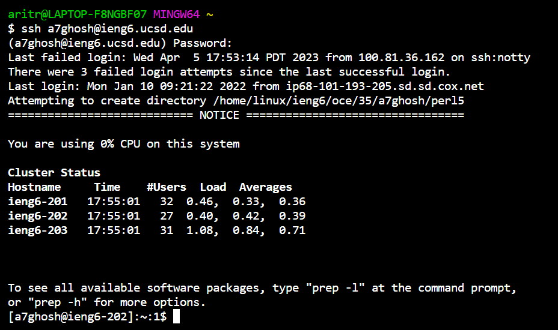
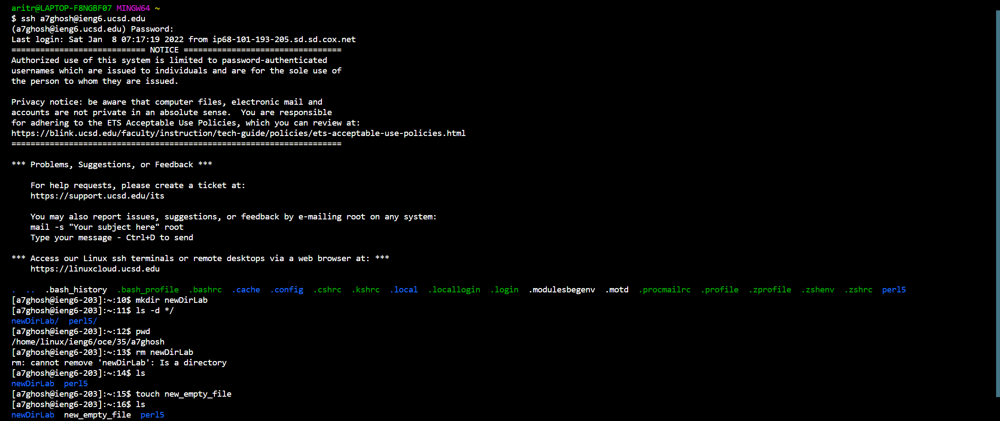
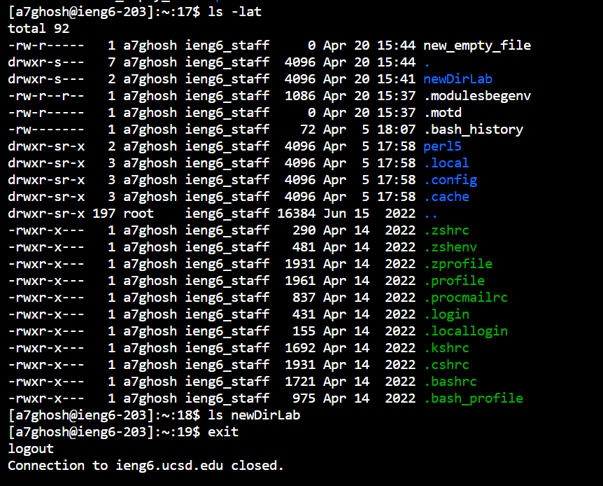
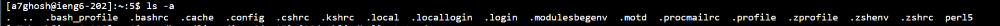

CSE 15L Lab Report 1
====================
**Welcome to Lab Report 1!** *This blog contains a tutorial for incoming CSE15L students.*


Overview: This lab report details the steps I took to during my own lab session. These steps include setting up your system, logging into remote access, and understanding the various commands one can try on the terminal.


Contents
--------

1. Installing VSCode
2. Remotely connecting
3. Trying some commands


Step 1: Installing Visual Studio Code (VSCode)
------------------------------------

For my CSE11: "Intro to Programming" class, I had installed VSCode to run my code. Consequently, I already had VSCode installed in my sytem upon entering this class. 
However, here's a link to get you started: [Link](https://code.visualstudio.com/).

After you have completed the required steps, you should have something that looks like this.




Step 2: Remote Connecting
-------------------------

We will now proceed to the next step of this tutorial. Our next step is to install **git**. To install **git** for my system (Windows), I used the this link: [Link](https://gitforwindows.org/). Once **git** is downloaded, you need to set up the terminal in VSCode to use **git bash**. For Windows, this link should help: [Link](https://stackoverflow.com/questions/42606837/how-do-i-use-bash-on-windows-from-the-visual-studio-code-integrated-terminal/50527994#50527994)

This brings us to end of our system setup! Now, we can use the **ssh** command to connect our system to the remote server. (*At this point, you should look up you sourse specific account. Follow this link to access it:* [Link](https://sdacs.ucsd.edu/~icc/index.php))

Now, open a terminal in VScode. Your command will look like this, but with the zz replaced by the letters in your course-specific account.

```
$ ssh cs15lsp23zz@ieng6.ucsd.edu
```

Congratulations! Your terminal is connected to a computer in the CSE Basement. For reference, here is what a screenshot of my connection looked like (*keep in mind I had a few failed login attempts*)




Step 3: Trying some commands
----------------------------

Let us try some commands! 

Here are is a brief list of the commands I tried during my lab session. Feel free to try any of them! 

1.**mkDir**    : This command is used to create a new directory (folder) within the file system.
2.**ls -d \*/**: This command lists all your directories (folders) within your current directory.
3.**ls**       : This command lists all the files in rhe current directory.
4.**cd**       : This command moves the current directory one directory backwards i.e the parent directory.
5.**pwd**      : This command prints the current working directory.
6.**touch**    : This command is used to create a new empty file.
7.**ls -lat**  : This command lists all files and directories in a directory, sorted by modification time in reverse order, with the most recently modified files   listed           first.
8.**ls -a**    : This command lists all files and directories in a directory, including hidden files and directories that start with a dot.
9.**cp**       : This command is used to copy files and directories.
10.**exit**     : This command is used to terminate a shell session.








*Conclusion*
-------------
That brings us to the end of the tutorial! Hope you had a good time!
  
 
