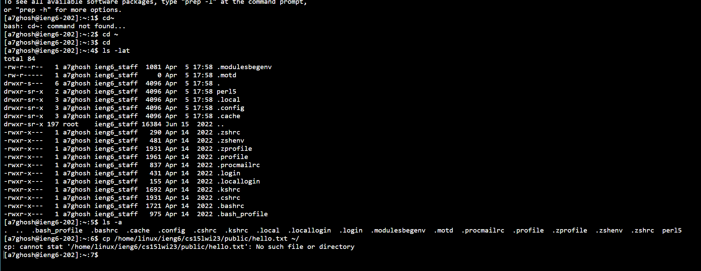

CSE 15L Lab Report 1
====================
**Welcome to Lab Report 1!** *This blog contains a tutorial for incoming CSE15L students.*


Overview: This lab report details the steps I took to during my own lab session. These steps include setting up your system, logging into remote access, and understanding the various commands one can try on the terminal.


Contents
--------

1. Installing VSCode
2. Remotely connecting
3. Trying some commands


Step 1: Installing Visual Studio Code (VSCode)
------------------------------------

For my CSE11: "Intro to Programming" class, I had installed VSCode to run my code. Consequently, I already had VSCode installed in my sytem upon entering this class. 
However, here's a link to get you started: [Link](https://code.visualstudio.com/).

After you have completed the required steps, you should have something that looks like this.


Step 2: Remote Connecting
-------------------------

We will now proceed to the next step of this tutorial. Our next step is to install **git**. To install **git** for my system (Windows), I used the this link: [Link](https://gitforwindows.org/). Once **git** is downloaded, you need to set up the terminal in VSCode to use **git bash**. For Windows, this link should help: [Link](https://stackoverflow.com/questions/42606837/how-do-i-use-bash-on-windows-from-the-visual-studio-code-integrated-terminal/50527994#50527994)

This brings us to end of our system setup! Now, we can use the **ssh** command to connect our system to the remote server. (*At this point, you should look up you sourse specific account. Follow this link to access it:* [Link](https://sdacs.ucsd.edu/~icc/index.php))

Now, open a terminal in VScode. Your command will look like this, but with the zz replaced by the letters in your course-specific account.

```
$ ssh cs15lsp23zz@ieng6.ucsd.edu
```

Congratulations! Your terminal is connected to a computer in the CSE Basement. For reference, here is what a screenshot of my connection looked like (*keep in mind I had a few failed login attempts*)


Step 3: Trying some commands
----------------------------

Let us try some commands! As a refresher, I have taken the liberty to list a few of the commands below:

1) cat <path1> <path2> ... Prints the contents of one or more files given by the paths
2) ls <path> - “List” Used to list the files and folders the given path
3) pwd - “Print working directory” Used to display the current working directory
4) cd <path> - “Change Directory” Used to switch the current working directory to the given path

Here are a few of the commands I tried during my lab session. Feel free to try any of them!
>
  

  
*Conclusion*
-------------
That brings us to the end of the tutorial! Hope you had a good time!
  
 
