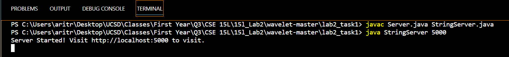
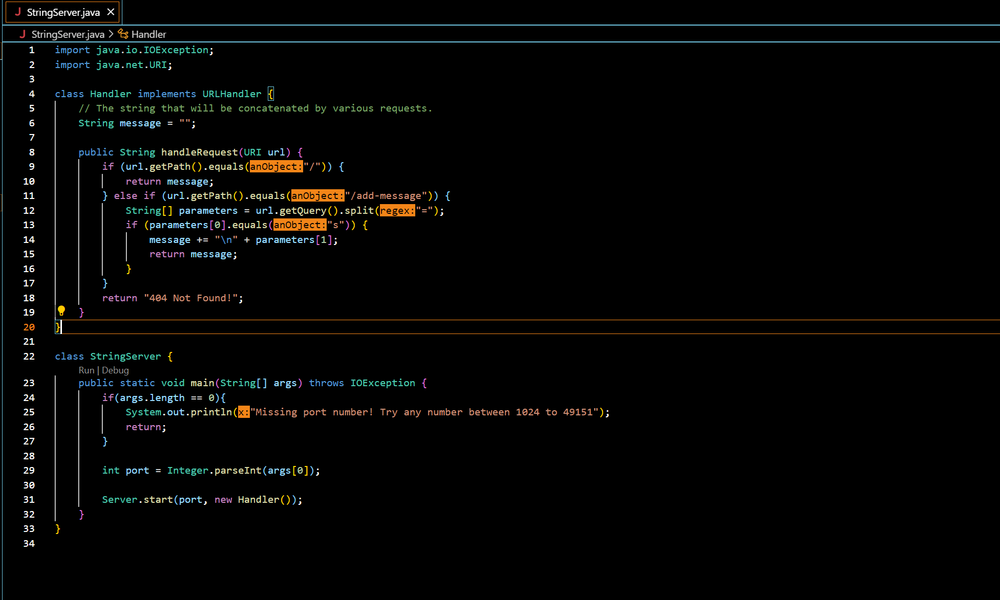
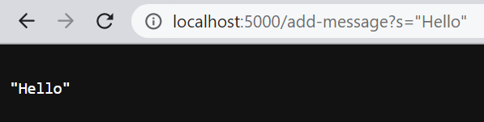
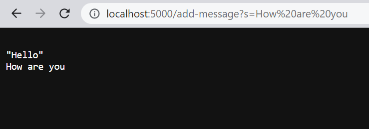
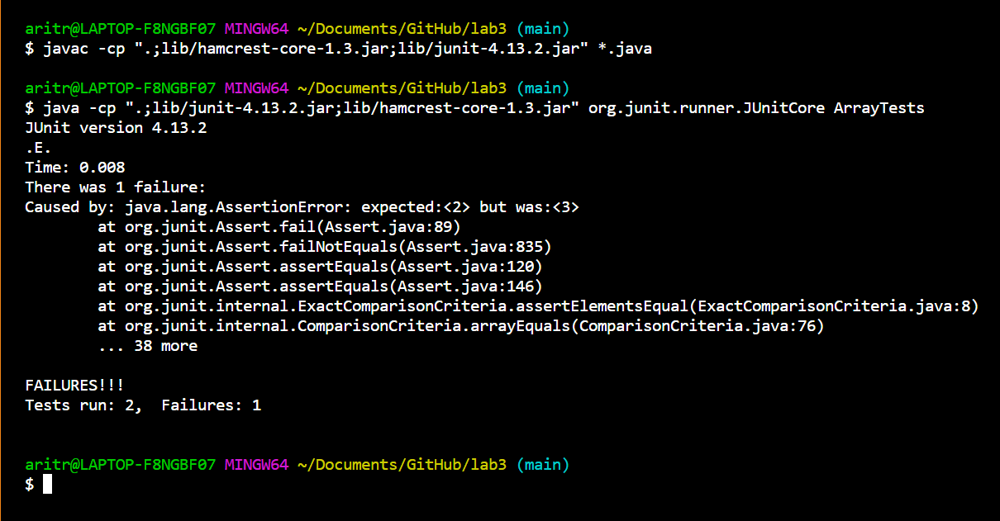
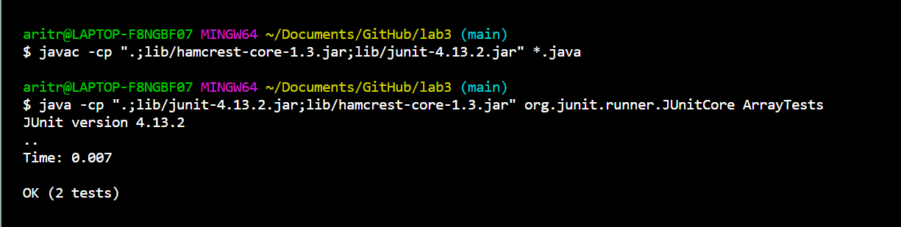

Lab Report 2
=============
Welcome to my secong lab report for CSE 15L. This lab report is divided into three parts, reflecting the three tasks for this lab report.

Task 1
------

After writing the required code for `StringServer`, we have to start a server session at localhost. 



Given below is the code for `StringServer`, followed by two screenshots of using `/add-message`.



*Screenshot 1*



*Screenshot 2*



Let us examine each of the screenshots in detail.

**Screenshot 1**

* The method `handleRequest` in my code is called. Its argument is `url` of class `URI`. There are two fields in that method, namely `message` and `parameters`. The method `handleRequest` calls additional methods. These methods are `getPath()`, `equals()`, `split()`, and `getQuery()`.

* The argument `new URI(http://localhost:5000/add-message?s="Hello")` is passed as the field `url` to the method `handleRequest`. The field `parameters` stores the array of Strings value `{"s", ""Hello""}`. The field `message` returns the String value `""Hello"\n"`.

* Due to passing the request `/add-message?s="Hello"`, the field `parameters` was initialized and the value of the field `message` was initialized and subsequently changed. The value of the field `message` was initialized to the empty String `""`. The value of the field  `parameters` was initialized to the array of Strings value `{"s", ""Hello""}`. Upon completion of the method run, the value of the field `message` is changed to the String value  `""Hello"\n"`. 

**Screenshot 2**

* Similarly, the method `handleRequest` in my code is called. Its argument is `url` of class `URI`. There are two fields in that method, namely `message` and `parameters`. The method `handleRequest` calls additional methods. These methods are `getPath()`, `equals()`, `split()`, and `getQuery()`.

* The argument `new URI(http://localhost:5000/add-message?s=How%20are%20you)` is passed as the field `url` to the method `handleRequest`. The field `parameters` stores the array of Strings value `{"s", "How are you"}`. The field `message` returns the String value `""Hello"\nHow are you\n"`.

* Due to passing the request `/add-message?s=How%20are%20you`, the field `parameters` was initialized and the value of the field `message` was initialized and subsequently changed. The value of the field `message` was initialized to the empty String `""`. The value of the field  `parameters` was initialized to the array of Strings value `{"s", "How are you"}`. Upon completion of the method run, the value of the field `message` is changed to the String value  `""Hello"\nHow are you\n"`. 

Task 2
---------

For Task 2, I choose to write tests and subsequently fix the buggy program `reverseInPlace`. Given below is the original code for the method `reverseInPlace`.

```
static void reverseInPlace(int[] arr) {
  for(int i = 0; i < arr.length; i+=1) {
    arr[i] = arr[arr.length - i -1 ];
  }
}
```

The following is a failure inducing input for the buggy program.

```
  @Test
  public void testReverseInPlace2() {
    int[] input2 = {1, 2, 3, 4};
    ArrayExamples.reverseInPlace(input2);
    assertArrayEquals(new int[] {4,3,2,1}, input2);
  }
```

The following is a non failure inducing input for the buggy program.

```
   @Test 
   public void testReverseInPlace() {
    int[] input1 = { 3 };
    ArrayExamples.reverseInPlace(input1);
    assertArrayEquals(new int[]{ 3 }, input1);
   }
```

Given below is the screenshot of the symptom upon running the buggy program.



Let us now proceed with fixing the bug. 

*Before:-*

```
static void reverseInPlace(int[] arr) {
  for(int i = 0; i < arr.length; i+=1) {
    arr[i] = arr[arr.length - i - 1];
  }
}
```

*After:-*

```
 static void reverseInPlace(int[] arr) {
   for(int i = 0; i < arr.length/2; i += 1) {
     int temp =arr[i];
     arr[i] = arr[arr.length - i - 1];
     arr[arr.length - i - 1] = temp;
   }
 }
```

The main issue with the original version of the program was that the original value of `arr[i]` was being lost as it was not stored in any temporary variable. Consequently, the new value of `arr[i]` was being assigned to `arr[arr.length - i - 1]`. The modified version of the program addresses this issue by first storing the original value of `arr[i]` in a temporary variable declared as `temp`. This corrected the misassignment of values to `arr[arr.length - i - 1]`.

Another issue that the modifed version of the program fixes is the nummber of iterations or traversals in the The modified version of the program fixes the issue. The modified version traverses till `arr.length/2`, which allows all the elements to swap symmetrically with each other, something that the original program did not account for.

The modified version of the program fixes these issues. Note that the symptoms of the bugggy program now disappear.




Task 3
------

Finally, for task 3, I would like to share a few facts that I was not aware of prior to week 2/3 of CSE 15L Spring 2023.

1. A symptom is a faulty behavior exhibited by the program.
2. One bug may cause multiple symptoms.
3. The same symptom may be caused by multiple different bugs.
4. URLs may be accessed from the command line with `curl`.


*This brings us to the end of my lan report 2 for CSE15L. Thanks for reading through! :)*


