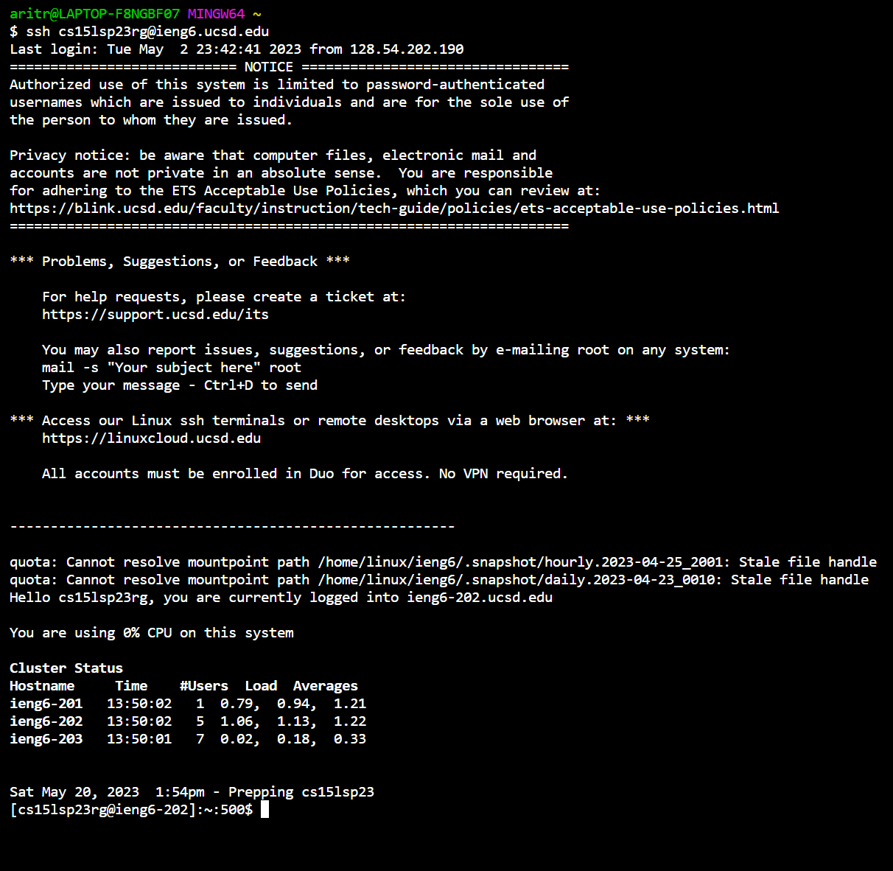

*Welcome to my Lab Report 4!*

In this Lab Report, we will explore some of the lab tasks from week 7. Specifically, we will be looking at the keys pressed for each step. This is important because it will help us identify room for impovement and analyze the time taken to achieve a task.

* Step 1: Log into ieng6

  Keys Pressed: To complete the write-up for this lab report, I opened a new Git Bash terminal in Visual Studio code. The command `ssh cs15lsp23rg@ieng6.ucsd.edu` was typed out followed by 
  `<enter>`. Since I had generated ssh keys for my ieng6 and GitHub account in week 7 lab, I avoided the hassle of entering my password for this step. Given below is a screenshot of this step.

