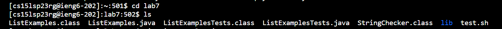

*Welcome to my Lab Report 4!*

In this Lab Report, we will explore some of the lab tasks from week 7. Specifically, we will be looking at the keys pressed for each step. This is important because it will help us identify room for impovement and analyze the time taken to achieve a task.

* Step 1: Log into ieng6

  Keys Pressed: To complete the write-up for this lab report, I opened a new Git Bash terminal in Visual Studio code. The command `ssh cs15lsp23rg@ieng6.ucsd.edu` was typed out followed by 
  `<enter>`. Since I had generated ssh keys for my ieng6 and GitHub account in week 7 lab, I avoided the hassle of entering my password for this step. Given below is a screenshot of this step.

 * Step 2: Clone your fork of the repository from your Github account
 
  Keys Pressed: The command `git clone https://github.com/ucsd-cse15l-s23/lab7` was 12 up in my search history, so I used the arrow key to access it. Once accessed, I ran it by hitting the  `<enter>` key. Since I had performed this step earlier in my lab, directory existed in my device. Given below is a screenshot of this step.
  

 * Step 3: Run the tests, demonstrating that they fail
 
  Keys Pressed: First, I typed the command `cd lab7`. Subsequently, I typed the command `ls` to have a glance at the contents of the directory. To look at the contents of the file `test.sh`, I typed the command `cat test.sh`. Upon learning that they contained the commands required to run the tests, I typed the command `bash test.sh` to deploy the program. Given below are the screenshots of this step.
  
