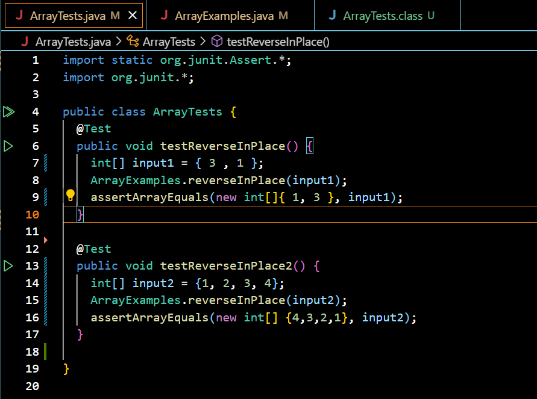

*Welcome to my Lab Report 5!*

Part 1 of this lab report is written in the style of a conversation on EdStem. It explores how a debugging scenario may unravel between a student asking for help and their tutor/TA.

Part 2 of this lab report is a reflection on my learning experience in CSE15L. It lists a few of the interesting things I learnt over the second half of the quarter.

* PART 1

**EdStem Post**


**TA/Tutor Response**

*Your code for reverseInPlace seems correct. Perhaps the error lies in your tests and not in your method? Please verify the expected and actual values from your tests*

**Student Response**

*After reviewing my tests again, I realized that I had inserted the incorrect expected value for my first test. I have now fixed that error. Thanks for the help.*




* PART 2

**Reflection**

In the second half of CSE15L, I learnt a ton about `vim`.  Here are a few commonly used `vim` commands I discovered while playing around with it.
```
i: Enter insert mode to start inserting text at the current cursor position.
Esc: Exit insert mode and return to normal mode.
:w: Save the current file.
:q: Quit Vim.
:wq: Save the current file and quit Vim.
dd: Delete the current line.
yy: Yank (copy) the current line.
p: Paste the contents of the clipboard after the current line.
u: Undo the last command or changes.
Ctrl+r: Redo the previously undone command.
:x: Save the current file and quit Vim if there are changes.
/search_term: Search for "search_term" forward in the file.
n: Move to the next occurrence of the previous search term.
N: Move to the previous occurrence of the previous search term.
:s/old/new: Replace the first occurrence of "old" with "new" in the current line.
:%s/old/new/g: Replace all occurrences of "old" with "new" in the entire file.
:set nu: Display line numbers.
:set nonu: Hide line numbers.
:set syntax=language: Set the syntax highlighting to the specified language (e.g., syntax=python).
:help: Open Vim's built-in help system.
```

*This brings us to the end of my lab report 5 for CSE15L. Thanks for reading through! :)*
